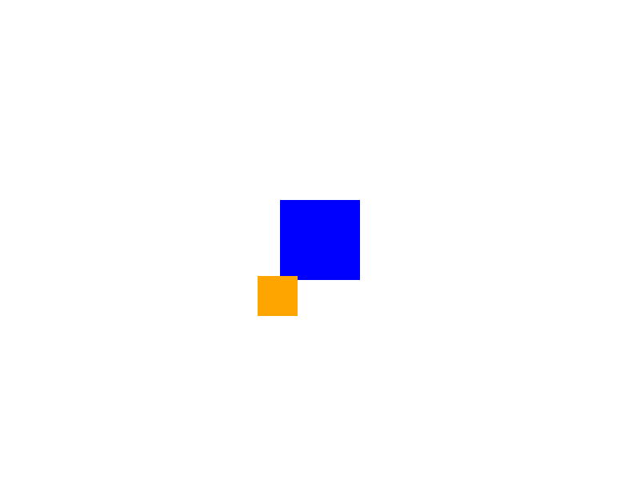

# YampaEngine

YampaEngine aims to speed up game developement with the FRP library [Yampa](https://github.com/ivanperez-keera/Yampa).

Screenshot of the example below:


Planned features:
- Display 2D graphics
- Play sound
- Collision detection
- Physics engine

Currently the only thing you can do is displaying Rectangles.

## How to Use

By importing YampaEngine, you automatically import:
- YampaEngine.MainLoop
- YampaEngine.Geometry
- YampaEngine.AppInput
- YampaEngine.AppOutput
- [Data.Colour.SRGB](https://hackage.haskell.org/package/colour-2.3.4/docs/Data-Colour-SRGB.html)
- [Data.Colour.Names](https://hackage.haskell.org/package/colour-2.3.4/docs/Data-Colour-Names.html)
- [Data.SG](https://hackage.haskell.org/package/SGplus-1.1)

In addition to importing YampaEngine, you also need to import a graphics backend. The only option right now is SDL, which you can find in YampaEngine.Backend.SDL. That means you need the library [sdl](https://www.libsdl.org/) installed on your pc.

Here is a working example that you can also find in the test folder.

```haskell
{-# Language Arrows #-}

import FRP.Yampa
import YampaEngine
import YampaEngine.Backend.SDL

main :: IO ()
main = do
  backend <- sdlBackend
  mainLoop backend sf


sf :: SF AppInput AppOutput
sf = proc input -> do
  let camera = Camera $ Rectangle (Point2 (0,0)) (800,600)
      obj1 =  Rectangle (Point2 (0,0)) (100,100)
      obj2 = Rectangle (Point2 (50,50)) (100,100)
  returnA -< AppOutput
    { graphics = Graphics
      { camera = camera
      , objects = [R obj1 blue 0, R obj2 orange 1]
      }
    , sound = []
    , shouldExit = False
    }
```

*Note:* This example app does not handle the quit event. That means you cannot close it :).
